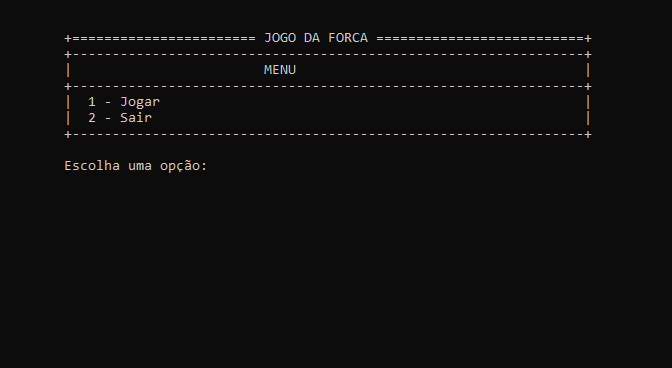
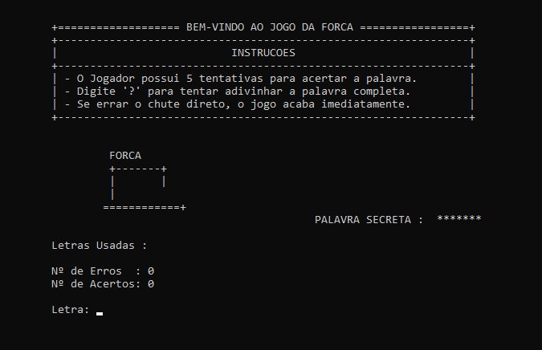
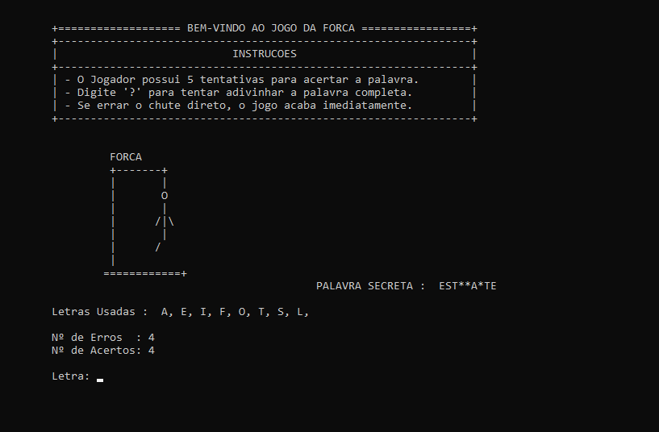
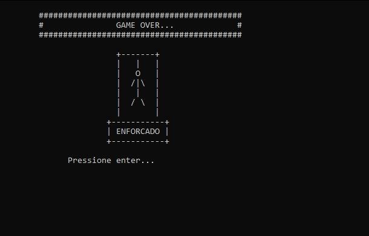
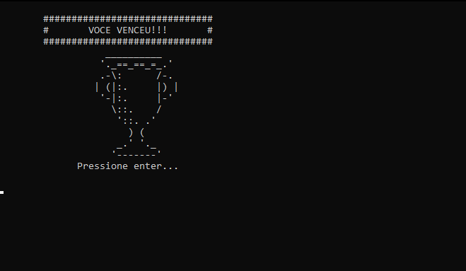

# Projeto Jogo da Forca - Linguagem C 🕹️

Este é um clássico Jogo da Forca desenvolvido em C, estruturado de forma modular para demonstrar boas práticas de programação, como o uso de headers e prototipagem de funções.

## 📸 Demonstração

Aqui podes ver o fluxo de funcionamento do programa:

### Menu Principal


### Instruções e Início do Jogo


### Dinâmica de Palpites


### Game Over / Enforcado


### Vitória - Palavra Descoberta


## 🛠️ Funcionalidades

- **Lógica de Jogo:** Verificação de acertos, erros e controle de tentativas.
- **Estrutura Modular:** Código dividido para facilitar a leitura e manutenção.
- **Prototipagem:** Definição clara das funções em arquivo de cabeçalho.
- **Interface via Terminal:** Interação direta e simples com o usuário.

## 📁 Estrutura do Projeto

O projeto utiliza a separação de responsabilidades entre arquivos:

* **`jogo.h` (Header File):** Contém a **prototipagem** de todas as funções e as definições de constantes.
* **`jogo.c`:** Implementação das funções e toda a lógica de funcionamento do jogo.
* **`projetoFinal.c`:** Ponto de entrada do programa (contém a função `main`).

## 🚀 Como Compilar e Executar

Como o projeto é modular, é necessário compilar os arquivos `.c` juntos:

```bash
# Compilação dos módulos
gcc jogo.c projetoFinal.c -o forca

# Execução
./forca
